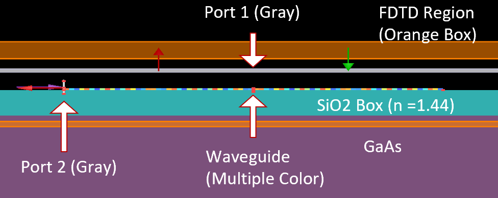

# Ansys Waveguide Modulation with Python Automation :computer:

## Description :page_with_curl:
This GitHub repository contains the source code and documentation for an automated simulation project using Ansys Lumerical software through Python. The project focuses on optimizing waveguide structures for light propagation using various grating shapes like sine, triangle, square, and sawtooth. The key objective is to fine-tune the waveguide's acoustic wavelength and modulation characteristics to improve optical diffraction efficiency.

## Features :sparkles:
- **Automated Structural Modifications**: Leverage the Ansys Lumerical Python API to automatically adjust waveguide dimensions to meet precise specifications.

- **Material and Design Specifications**:
  - Waveguide Core: The core material, featuring a refractive index of 2.0, is modulated with subtle sine wave variations.
  - Supporting Structure: SiO2 box with a refractive index of 1.44 to isolate the waveguide.
- **Simulation Techniques**:
  - **Mode Injection**: Use of Port 2 to inject light modes with minimal refractive index leakage.
  - **Data Acquisition**: Capture E-field data at Port 1 using ANSYS Lumerical FDTD for comprehensive analysis.
  - **Grating Modulation**: Control over the waveguide’s modulation via variables like K_grating and x_span.
- **Comparative Analysis**: Evaluate different grating shapes to ascertain the most efficient pattern in terms of optical diffraction efficiency.

## Detailed Results :bar_chart:
### Ansys Simulation Results
- **Grating Efficiency Analysis**: The sine wave grating consistently produces the highest peak, which aligns closely with theoretical expectations, demonstrating the best optical diffraction efficiency.
- **Waveguide Length Consideration**: The analysis determined the minimum waveguide length required for effective light transmission, which enhances the setup's practical application in real-world scenarios.
- **Scalability**: Successfully extended the 2D modeling equations to 3D to accommodate realistic scenarios and broader application contexts.

### Dipole Simulation Results
- **Model Validation**: The Dipole Simulation results matched perfectly with theoretical values, confirming the accuracy of the simulation models used.
- **Efficiency Comparison**: Dipole Simulations demonstrated a similar trend in efficiency across varying grating shapes, with adjustments in dipole configuration slightly altering the output, highlighting the importance of precise mode selection.
- **Operational Flexibility**: Unlike Ansys Simulation, Dipole Simulation does not depend heavily on mode selection, offering more robust and consistent results.

## Installation Instructions :gear:
1. **Clone the Repository**: 
   ```bash
   git clone https://github.com/Sunghwan0112/Waveguide-Modulation-Project-ECE-M.S.
   ```
2. **Setup Environment**:
   - Ensure Python 3.8+ is installed.
   - Install Ansys Lumerical software and configure it to integrate with Python.
3. **Install Dependencies**:
   ```bash
   pip install -r requirements.txt
   ```

## Contact :mailbox_with_mail:
- Sunghwan Baek - [your-email@example.com](mailto:your-email@example.com)
- Project Link: [https://github.com/Sunghwan0112/Waveguide-Modulation-Project-ECE-M.S.](https://github.com/Sunghwan0112/Waveguide-Modulation-Project-ECE-M.S.)


